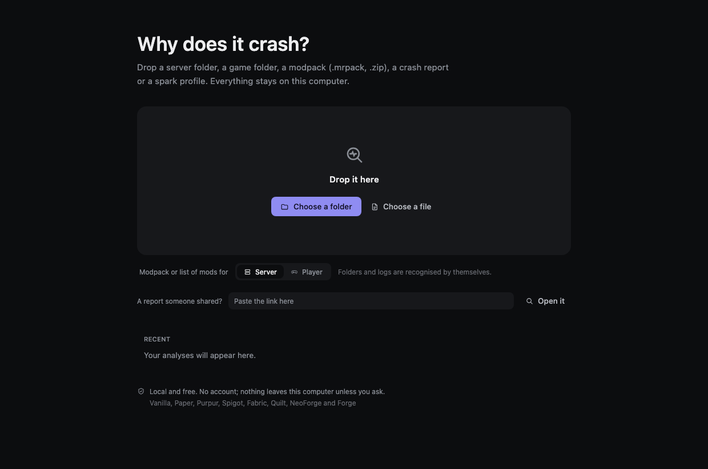

# CrashSleuth

**Find out why Minecraft crashes, and who is to blame.**

You paste a log, or point CrashSleuth at your server folder. It tells you what broke, **which mod or plugin
is at fault**, and what to do about it — in a sentence you can act on, not a stack trace you have to decode.

When the log is not enough, it launches the server or the game itself, with fewer mods each time, until the
culprit is the only explanation left. You never have to answer "did it crash?" after every run.

## Get it

| Your system | File |
| --- | --- |
| Windows 10 / 11 | [`.msi` installer](https://github.com/Holo795/CrashSleuth/releases/latest) |
| macOS (Apple silicon) | [`.dmg`](https://github.com/Holo795/CrashSleuth/releases/latest) |
| Linux (Debian, Ubuntu, Mint) | [`.deb` package](https://github.com/Holo795/CrashSleuth/releases/latest) |
| Anything with Java 21 | [portable `.zip`](https://github.com/Holo795/CrashSleuth/releases/latest) |
| Terminal and assistants | [command-line `.zip`](https://github.com/Holo795/CrashSleuth/releases/latest) |

[**Installation**](Install) walks through each one, including the warning Windows and macOS show for an
application they have not seen before.

## Start here

- [**Your first analysis**](First-analysis) — what to drop on it, and what it does with it.
- [**Reading a report**](Reading-a-report) — what the title, the culprit and the confidence actually mean.
- [**Sharing a report**](Sharing-a-report) — one link, nothing uploaded.
- [**Finding the culprit**](Finding-the-culprit) — when the log names nobody, it launches and finds out.

## Going further

- [**Command line**](Command-line) — every command, with what it prints.
- [**Assistants (MCP)**](Assistants-MCP) — let an assistant read your server instead of guessing.
- [**What it covers**](What-it-covers) — platforms, and the things it deliberately stays quiet about.
- [**Supported versions**](Supported-versions) — the exact Minecraft versions tested, platform by platform.
- [**What leaves your computer**](Privacy) — the short answer is: nothing, unless you ask.
- [**How it is tested**](How-it-is-tested) — 62 problems real people reported, replayed with the same jars.
- [**Contributing**](Contributing) — sending a log that is not understood, or a rule that reads it.
- [**FAQ and troubleshooting**](FAQ)

## What makes it different

Most tools repeat the loudest line of the log. In this ecosystem that line almost always names the mod that
**noticed** the problem, not the one that caused it. CrashSleuth is built against that:

- a mixin that could not be applied names the mod that **lost**; the one that got there first is named instead;
- Fabric's crash screen names the mod whose entrypoint was running — one author renamed his class to
  `Crash_Is_Not_Caused_By_BetterClouds` over it — so the `Caused by` chain is read instead;
- "fix your datapacks or use `--safeMode`" is the game's stock sentence, printed for a mod's own sealed
  data and for a world coming back from a newer version; neither lives in your datapacks folder;
- a missing `java.util.List.removeFirst()` is Java 21 being absent, not a broken mod;
- "give it more RAM" is never said when an environment variable is already overriding the memory you set.

[The full list](What-it-covers#what-it-refuses-to-say), with the report behind each one.
