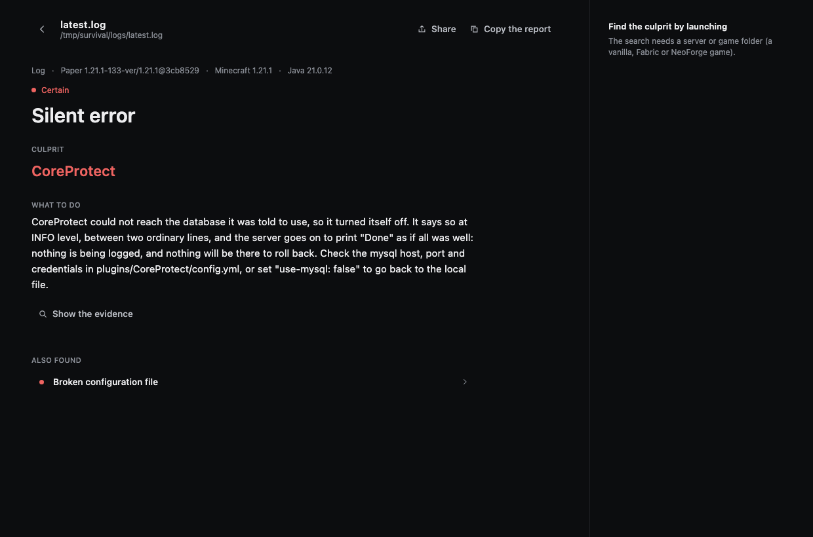
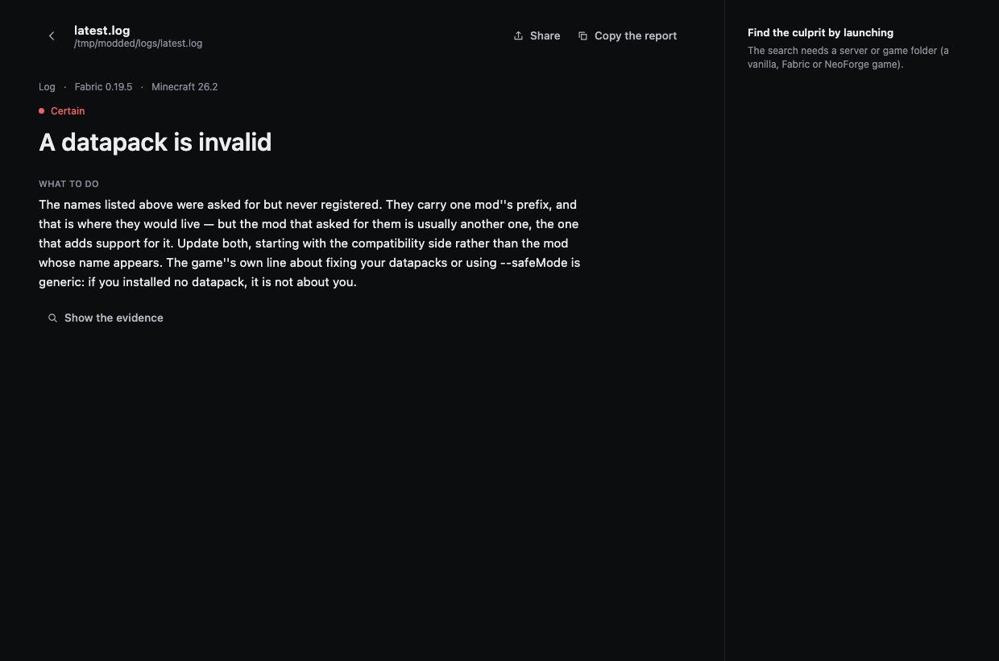

# Reading a report

A report answers three questions, in order: **what happened**, **who is responsible**, **what to do**.

## The header

`Log · Paper 1.21.1-133 · Minecraft 1.21.1 · Java 21.0.12`

What CrashSleuth worked out about your setup on its own: whether it read a log, a crash report or a whole
folder, which server software, which Minecraft, which Java. If one of those is wrong, doubt everything under
it — a wrong version here is usually the sign that you pointed it at the wrong folder.

## Confidence

The coloured dot above the title. Four levels, each meaning something precise:

| Level | What it means |
| --- | --- |
| **Certain** | The log states it. There is nothing left to interpret. |
| **High** | One well-known message, read the way the people who wrote it meant it. |
| **Medium** | Consistent with the evidence, but another explanation exists. |
| **Low** | A lead, not an answer. Worth checking before acting on it. |

A **Low** finding is still shown, because knowing where to look is worth something. It is never dressed up
as a conclusion.

## The culprit

The mod, plugin, file or setting to change. This is the part most tools get wrong, so it is worth saying
plainly what happens here.

**The name in the log is usually the one that noticed, not the one at fault.** A mixin that failed names the
mod that *lost* the race. `Could not pass event … to X` names whoever registered the listener. Fabric's
crash screen names the mod whose entrypoint happened to be running — one author ended up renaming his class
to `Crash_Is_Not_Caused_By_BetterClouds` over it.

In each of those cases CrashSleuth looks past the loud name, reports the code that actually failed, **says
that it did**, and names the other one second so you can still check it:

> `badoptimizations` is the code that actually failed. The loader's screen names `betterclouds` because the
> game was running its entrypoint at that moment, and that is the first and largest line people read: it is
> not a diagnosis.

When it genuinely cannot tell, it names nobody rather than picking someone.

## What to do

The sentence that matters. It is written to be acted on without knowing what a mixin is, and it says *why*,
so you can tell when it does not apply to you.

When the obvious fix would be wrong, it says so. Two real examples:

> The database this plugin was told to use did not answer. The plugin is not at fault and **updating it will
> change nothing**: check the address, the port, the credentials […]

> The method that is missing belongs to Java itself: this family arrived in Java 21. […] **The mod named in
> the trace is where the call happens, not what is broken.**

## Show the evidence

The exact lines the conclusion rests on. Open it to check the reasoning — or when you are about to tell a
mod author "your mod is broken" and want the line that proves it.

Turn on **readable traces** and obfuscated game code like `class_310.method_22681` or `fgo.b` becomes
Mojang's own names first, using mappings downloaded once.

## Also found

Everything else, ordered by confidence. A second finding is not noise: a server can have a broken config
*and* an outdated plugin, and the one that stopped it today is not always the one that will bite tomorrow.

In the screenshot above, `Broken configuration file` sits under the silent error — the same root cause seen
from the other side.

## A modded server

Same structure, different world. Here the server refused to start, every identifier in the error carried one
mod's name — and that mod was not the one at fault. The advice says so, and says which one to look at first.

## Taking it elsewhere

- **Copy the report** puts a plain-text version on the clipboard: ready for a Discord thread or a GitHub
  issue, with the environment, the finding and the evidence.
- **Share** turns the whole report into a link. [How that works, and why nothing is uploaded →](Sharing-a-report)
- **Find the culprit by launching** is on the right when the folder can be started.
  [What it does →](Finding-the-culprit)
