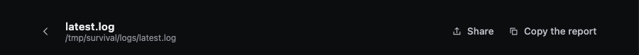
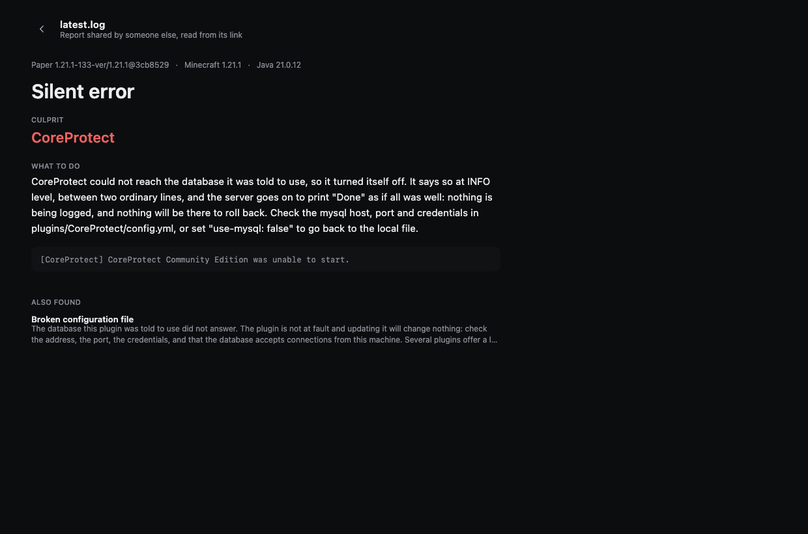

# Sharing a report

You want someone else to look at your crash. You do not want to upload your server, and you do not want a
paste that expires in a week.

**Share** gives you one link. The report travels *inside* the link.

## How to share one

**In the app** — open a report and click **Share**, at the top right of the report:



The link goes straight onto your clipboard. Paste it into Discord, a GitHub issue, a forum thread,
wherever. (**Copy the report**, next to it, gives plain text instead — handy where a long link would be
cut.)

**From the command line**:

```bash
crashsleuth analyze /srv/minecraft --share
```

It prints a link that looks like this:

```
https://holo795.github.io/CrashSleuth/r/#r=XVNNb9swDP0rhLBj6tZNu605bcv6kWFri7W3tgdGph0hipR...
```

## How to open one someone sent you

Either way works:

- **Click it.** It opens in any browser, no install, no account.
- **Paste it into the app**, in the *"A report someone shared?"* box on the home screen, and read it with
  the same interface as your own reports.

This is what they see — your report, with a line saying it was read from a link:



## Why nothing is uploaded

Look at the link again. Everything after the `#` is the report itself, compressed and encoded.

A browser **never sends the part after the `#`** to the server. It is called the fragment, and it exists to
point at a place inside a page; it stays in the browser. So when someone opens your link:

- the page at `holo795.github.io/CrashSleuth/r/` is fetched — a static page, the same for everyone;
- the report is decoded **in their browser**, from the link they already had;
- no server ever receives it, GitHub included.

Nothing is uploaded when you create the link either: making it is pure arithmetic on your own machine. No
account, no expiry, no port opened, no service to trust — and nothing to delete afterwards, because nothing
was stored.

## What is inside the link

The report, not your files. That means:

- the environment line (server software, Minecraft version, Java version);
- the findings: situation, confidence, culprits, advice;
- the evidence lines quoted in the report;
- the list of mods or plugins, when the analysis had it.

It does **not** contain your logs in full, your world, your configuration files, your IP address or your
player list. What you can see in the report is what the other person gets — nothing behind it.

Still worth a glance before sharing: an evidence line comes from your log, and a log can mention a folder
path with your name in it, or a player name. Read what you are sending, the way you would read a paste.

## How long the link lasts

As long as the page stays online. There is nothing to expire, because there is nothing stored anywhere: two
years from now the same link decodes the same report.

The flip side: a very large report makes a very long link. Some chat clients cut long links — if yours does,
send it as a file or use **Copy the report** instead, which gives plain text.
